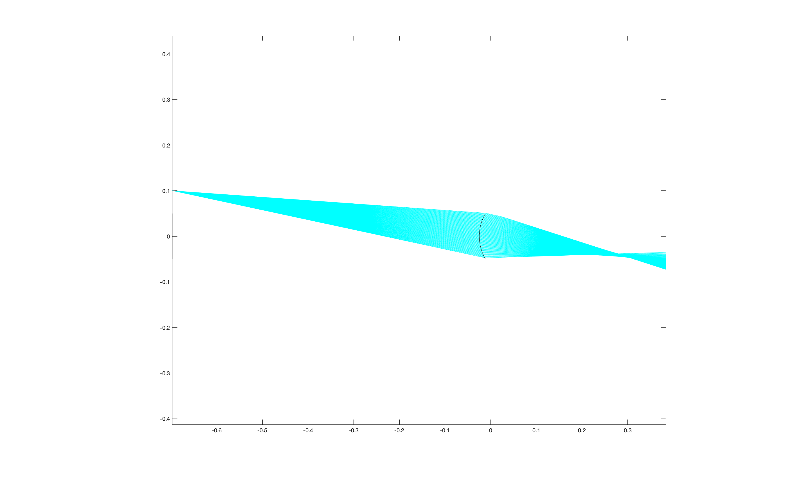

# lens-simulator
単レンズにおける撮像シミュレータ

## Description
MATLAB上で単レンズによる光の屈折をシュミレートするプログラム

#### ディレクトリ構成
<pre>
├── README.md
├── dataset
│   └── standard_test_images  # よくあるサンプル画像群
└── matlab
    ├── create_real_image_with_lens.m
    ├── fetch_variables.m
    ├── lens_simulator.m
    └── plot_image_formation.m
</pre>

## Preview
### 1点からの結像シミュレーション

## Requirement
<pre>
#依存ソフトウェア(on Mac)
matlab
</pre>

## Usage
MATLAB上で実行してください（適当）

